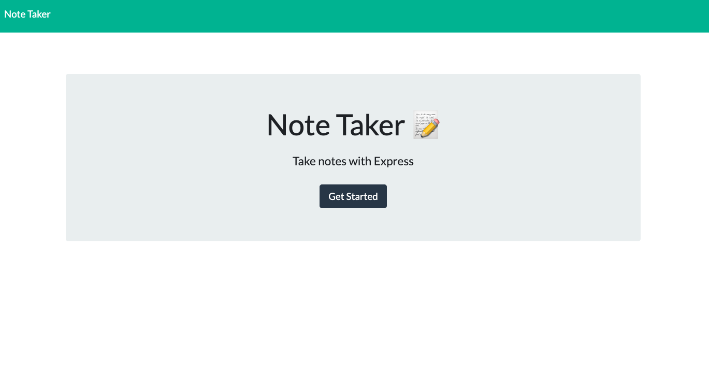
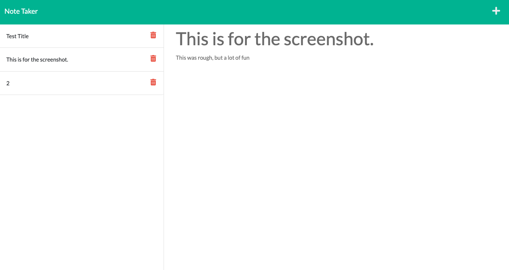
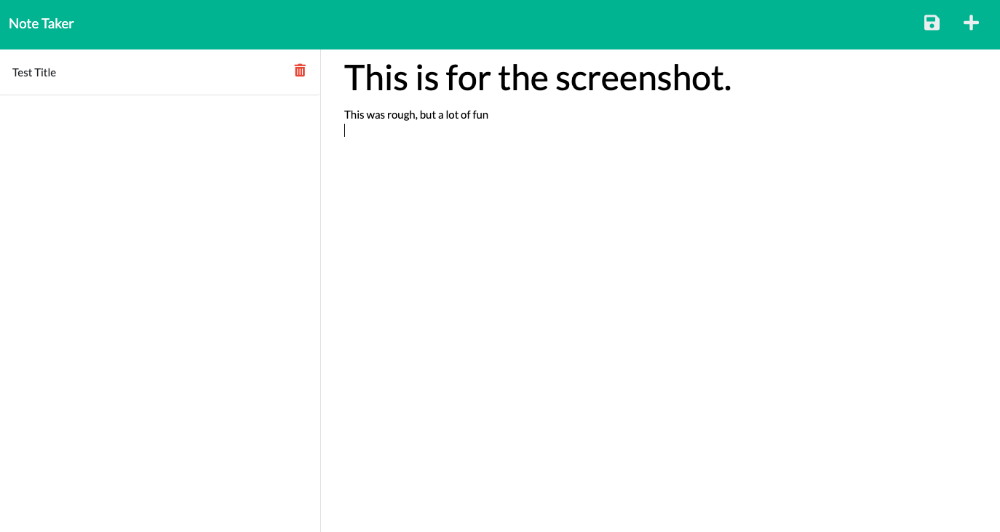

# supreme-broccoli

## Description

This is a note-taker web app that allows anyone to set a title and write notes. This application is a great way to take care of day-to-day tasks by simply just using the notes for tasks and deleting when done. This project has taught me how to use backend servers and new programs such as Heroku for deployment.

## Installation

Go to the web link: https://limitless-scrubland-97242.herokuapp.com/

## Usage

To use this application just simply go to https://limitless-scrubland-97242.herokuapp.com/ and click Get Started. It will take you to the note taking page. On the right column fill in the information for note title and note text. Once this is filled out a save button will appear on the right side of the screen above the text entry location. Click the save icon and it will save your note to the left column. On the left column you can toggle through your notes. If you are done with a particular note just simply click the red trash can and it will be deleted. 

    ,
    ,
    

    

## Webpage Link

https://limitless-scrubland-97242.herokuapp.com/